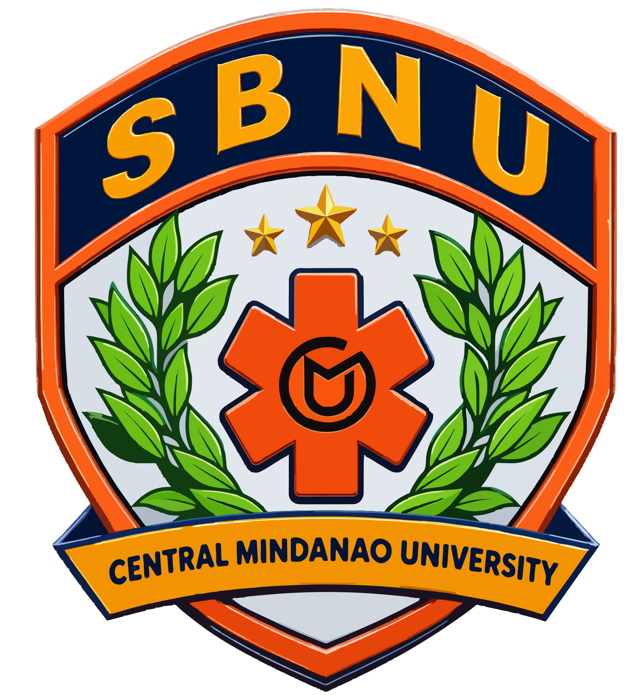

# CMU SBNU VMS Branding

**Status:** Internal branding draft. Confirm institutional approval before using this arrangement in a public release or official publication.

## Primary logo and project icon

Use the School-Based National Service Reserve Corps Unit (SBNU) mark as the primary project logo and app icon.

  

The platform launcher icons are generated from [`assets/images/sbnu_app_icon.png`](../assets/images/sbnu_app_icon.png), a square version of the SBNU logo on a white background. Generation settings are in [`flutter_launcher_icons.yaml`](../flutter_launcher_icons.yaml).

## Supporting organization logos

Display the organization marks side by side in this order: Central Mindanao University, Office of Disaster Risk Reduction and Management, then School-Based National Service Reserve Corps Unit. The SBNU mark remains the primary logo.

<table>
  <tr>
    <td align="center" width="33%">
      
    </td>
    <td align="center" width="33%">
      
    </td>
    <td align="center" width="33%">
      
    </td>
  </tr>
</table>

## Branding name

**Central Mindanao University - Office of Disaster Risk Reduction and Management - School-Based National Service Reserve Corps Unit**

## Source assets

- CMU: [`assets/images/cmu_logo.svg`](../assets/images/cmu_logo.svg)
- ODRRM: [`assets/images/odrrm_logo.svg`](../assets/images/odrrm_logo.svg)
- SBNU: [`assets/images/sbnu_logo.svg`](../assets/images/sbnu_logo.svg)

## App theme direction

The app theme draws supporting colors from all three supplied marks while keeping SBNU as the primary identity. Use SBNU navy and warm orange as the main interface colors. Use CMU gold and green, plus ODRRM forest green, olive, and yellow, as restrained supporting accents. Keep the supplied logo artwork intact; these UI colors do not redefine official institutional brand standards.

The local landing page presents the organization marks in CMU, ODRRM, SBNU order, with the SBNU mark emphasized as the primary unit identity.

The logo files are referenced in place; this document does not create modified logo artwork or specify official colors, spacing rules, or other brand standards.
